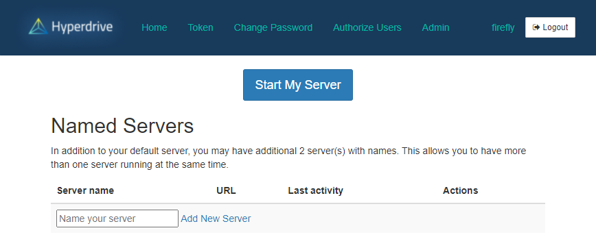
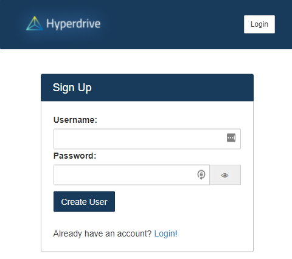
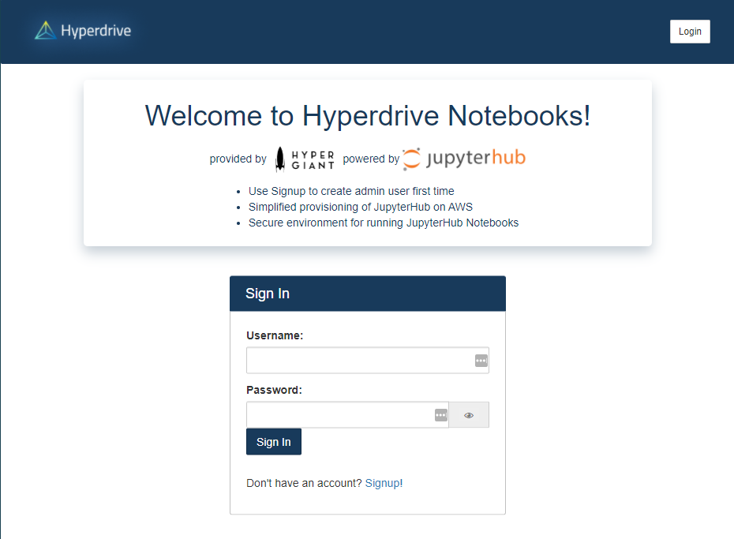
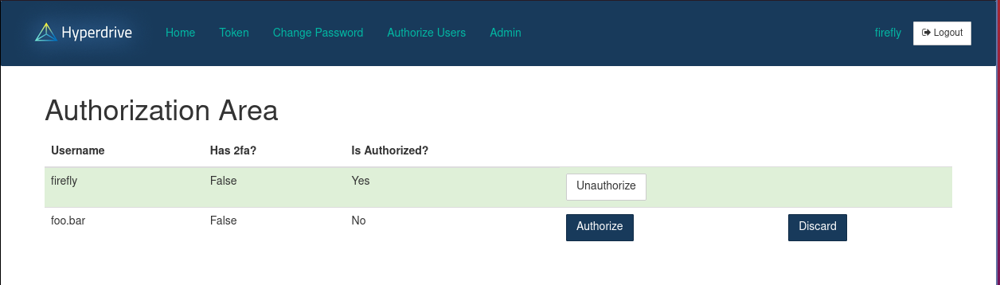
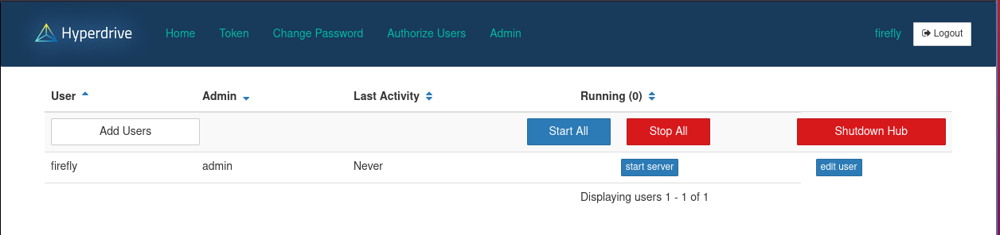

<div id="top"></div>
<!-- PROJECT LOGO -->
<br />
<div align="center">
  <a href="https://github.com/gohypergiant/firefly">
    
  </a>

<h3 align="center">Hyperdrive Notebooks</h3>

  <p align="center">
    Deploy and manage Jupyterlab and Hyperdrive Community Edition locally, on AWS, or to any Kubernetes cluster
    <br />
    <a href="https://hyperdrive-notebooks.s3.us-east-2.amazonaws.com/hd-notebooks-aws-deployment-guide.pdf"><strong>Explore the docs »</strong></a>
    <br />
    <br />
    <a href="https://github.com/gohypergiant/firefly">View Demo</a>
    ·
    <a href="https://github.com/gohypergiant/firefly/issues">Report Bug</a>
    ·
    <a href="https://github.com/gohypergiant/firefly/issues">Request Feature</a>
  </p>
</div>


<!-- TABLE OF CONTENTS -->
<details>
  <summary>Table of Contents</summary>
  <ol>
    <li>
      <a href="#about-the-project">About The Project</a>
      <ul>
        <li><a href="#built-with">Built With</a></li>
      </ul>
    </li>
    <li>
      <a href="#getting-started">Getting Started</a>
      <ul>
        <li><a href="#prerequisites">Prerequisites</a></li>
        <li><a href="#installation">Installation</a></li>
      </ul>
    </li>
    <li><a href="#usage">Usage</a></li>
    <li><a href="#roadmap">Roadmap</a></li>
    <li><a href="#contributing">Contributing</a></li>
    <li><a href="#license">License</a></li>
    <li><a href="#contact">Contact</a></li>
    <li><a href="#acknowledgments">Acknowledgments</a></li>
  </ol>
</details>


<!-- ABOUT THE PROJECT -->
## About The Project

<div align="center">
    
</div>

### Built With

- [k3s](https://k3s.io/)
- [k3d](https://k3d.io/)
- [Zero To Jupyterhub](https://github.com/jupyterhub/zero-to-jupyterhub-k8s)

<p align="right">(<a href="#top">back to top</a>)</p>

<!-- GETTING STARTED -->
## Getting Started

### Local deployment

#### Prerequisites

* docker - [Install](https://docs.docker.com/get-docker/)
* k3d - [Install](https://k3d.io/v5.0.0/#install-script)
  * Must be 5.0 or greater
* kubectl - [Install](https://kubernetes.io/docs/tasks/tools/)
* Helm 3 - [Install](https://helm.sh/docs/intro/install/)

#### Installation

1. Install prerequisites.
2. Clone the repo
   ```sh
   git clone https://github.com/gohypergiant/firefly.git
   ```
3. Run the build script
   ```sh
   build.sh
   ```
4. The stack takes approximately 2 minutes to install. After that, navigate to `http://localhost:8090/` to access Firefly.

<p align="right">(<a href="#top">back to top</a>)</p>

### Pre-existing cluster (Helm)

#### Prerequisites

* kubectl - [Install](https://kubernetes.io/docs/tasks/tools/)
* Helm 3 - [Install](https://helm.sh/docs/intro/install/)
* An existing kubernetes cluster

#### Installation

1. Install prerequisites.
2. Add the helm repo
   ```sh
   helm repo add firefly https://gohypergiant.github.io/firefly
   ```
3. Install the helm chart with `helm install firefly firefly/firefly`. Be sure to include your customized values file.

4. The stack takes approximately 2 minutes to install. After that, navigate to `http://localhost:8090/` or the ingress host specified in your values file to access Firefly.

<p align="right">(<a href="#top">back to top</a>)</p>

### AWS CloudFormation

#### Prerequisites

* An AWS account
* A route53 zone
* An SSH keypair added to AWS
* An IAM user with permissions to deploy and configure EC2 instances and DNS via Cloudformation

#### Installation

See the [user manual](https://hyperdrive-notebooks.s3.us-east-2.amazonaws.com/hd-notebooks-aws-deployment-guide.pdf) for instructions

<p align="right">(<a href="#top">back to top</a>)</p>


## Usage

Firefly/Hyperdrive Notebooks is designed to make the already amazing Zero2Jupyterhub even easier to launch and manage while providing enhancements via the Community Edition of Hyperdrive. It can be deployed locally, onto an existing Kubernetes cluster, or via Cloudformation on AWS.

After launching your deployment, navigate to the signup page to create the first user, named `firefly`

`firefly` is the default admin and first authorized user, but does not have a password until the user is registered for the first time. This allows you to set your own password when the stack is launched for the first time. Your password must be 10 characters or longer.

<div align="center">
  <a href="http://localhost:8090/hub/signup">
    
  </a>
</div>

<p align="right">(<a href="#top">back to top</a>)</p>

After registering the first user, you can now log in and authorize or manage additional users

<div align="center">
  <a href="http://localhost:8090/">
    
  </a>
</div>

<div align="center">
  <a href="http://localhost:8090/hub/authorize">
    
  </a>
</div>

<p align="right">(<a href="#top">back to top</a>)</p>

Or you can administer the Hub itself as an admin user

<div align="center">
  <a href="http://localhost:8090/hub/admin">
    
  </a>
</div>

<p align="right">(<a href="#top">back to top</a>)</p>

<!-- ROADMAP -->
## Roadmap

- [ ] GPU support
- [ ] Hyperdrive Community Edition
- [ ] Additional profiles
- [ ] RBAC

See the [open issues](https://github.com/gohypergiant/firefly/issues) for a full list of proposed features (and known issues).

<p align="right">(<a href="#top">back to top</a>)</p>

<!-- CONTRIBUTING -->
## Contributing

Contributions are what make the open source community such an amazing place to learn, inspire, and create. Any contributions you make are **greatly appreciated**.

If you have a suggestion that would make this better, please fork the repo and create a pull request. You can also simply open an issue with the tag "enhancement".
Don't forget to give the project a star! Thanks again!

1. Fork the Project
2. Create your Feature Branch (`git checkout -b feature/AmazingFeature`)
3. Commit your Changes (`git commit -m 'Add some AmazingFeature'`)
4. Push to the Branch (`git push origin feature/AmazingFeature`)
5. Open a Pull Request

<p align="right">(<a href="#top">back to top</a>)</p>


<!-- LICENSE -->
## License

Distributed under the Apache-2 License. See [`LICENSE`](LICENSE) for more information.

<p align="right">(<a href="#top">back to top</a>)</p>


<!-- ACKNOWLEDGMENTS -->
## Acknowledgments

* [k3s and k3d](https://k3d.io/v5.0.1/)
* [Zero to Jupyterhub](https://github.com/jupyterhub/zero-to-jupyterhub-k8s)

<p align="right">(<a href="#top">back to top</a>)</p>
